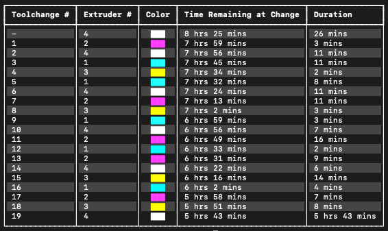

## ColorChangeInfo

ColorChangeInfo will look through your g-code and find any color changes that
are present. It will then determine when in the print the color changes are
going to happen and show you a summary of all of them. This is useful when you
have a multi-color print and you are doing manual filament changes. With the
help of this tool, you can know exactly when the filament changes are going to
happen and be ready for them. The tool will also tell you what color is
supposed to be loaded next.

**Note:** This only works for color changes that are configured through multiple
extruders or single extruder multiple material. Layer height color changes will
not be found using this tool. This is intentional, since PrusaSlicer already
tells you when layer height color changes will happen.

This can be run by directly invoking it with Python. It does require some
dependencies so those must be installed prior to use. I've included both a
`Pipfile` and a `requirements.txt` file so either `Pipenv` or `pip` can be
easily used.

This tool works well. It is also pretty accurate. It gets the time information
from the estimated progress times in the g-code. So if you generally have good
results with the slicer's estimated times, this should work well for you too. I
created this because I was going to print out a color lithophane generated from
[Color Lithophane Maker](https://lithophanemaker.com/Color%20Lithophane.html)
but I don't have an MMU. This helped quite a bit, as it made it much easier to
know which color filament I was supposed to load, gave me an idea of how much
time I had until the next change, and how long all the changes in total would
take. Hopefully someone else will find this just as useful as I did!
