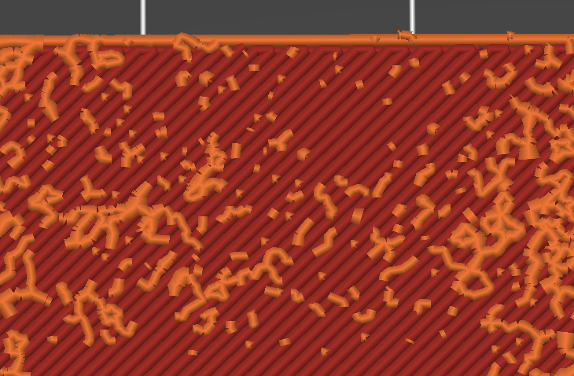

## ColorLitho

ColorLitho consists of 3 post processing scripts that can all be used together.
They were all made for, you might have guessed it, color lithophanes. I made my
color lithophanes with
[Color Lithophane Maker](https://lithophanemaker.com/Color%20Lithophane.html).
Let's break each one down.

## ColorWipe

ColorWipe will perform a custom wipe before travel moves greater than the wipe
threshold. The wipe this performs is different than a normal wipe in that rather
than wiping onto the extruded part, it wipes in the same direction the nozzle
was already moving as it was extruding. After this wipe, it will perform a
z-hop, move to the next location, z-hop down and continue.

The idea with this was to see if it was possible to avoid the little zits that
z-hopping can create, while also realizing the benefits of z-hopping. The main
benefit in this case is avoiding scraping the current layer with the nozzle.
This is more likely to happen with a color lithophane since the nozzle has to
repeatedly move over the same areas when it extrudes the next filament of a
different color.

Here's a picture to try to better show what is happening:

This can be run by either directly invoking it with Python, or as a PrusaSlicer
post-processing script.

This works well as far as generating the g-code goes. I think this helped in
particular with very small "pixels". I also think it improved the surface
quality, but it is kind of difficult to objectively quantify that. It produced a
layer that I felt was "smoother" than a layer printed with z-hop, but there was
also no nozzle scraping like there would be if z-hop was off. It also might not
matter very much to the end result, since the top layers of the color
lithophanes are the actual lithophane part, made of only white filament. I never
fully printed one with each different approach to compared the final print. I
usually stopped the print after the color section was finished. This was done
due to time constraints when I was trying to get this project finished. But it
could be useful to make a complete color lithophane and compare the 3 different
results (z-hop, no z-hop, ColorWipe).

## ColorReorder

ColorReorder was an experimental script I tried out after I thought ColorWipe
was working well. I noticed with ColorWipe it seemed to work better when the
wipe happened over an area where the layer had no filament. It seemed like when
the nozzle moved over an open spot on the layer, the potential zit would not
occur. I think this might have had to do with breaking the suction in the
nozzle. Since CustomWipe lets retractions happen like normal, when the nozzle
moves over the open section, air can get in and break the suction, letting the
filament that was printed, stay flat on the print. When the nozzle did the
custom wipe over a part of the layer that was already printed, it still left a
tiny zit.

If you've used
[Color Lithophane Maker](https://lithophanemaker.com/Color%20Lithophane.html)
before you might have noticed that each color layer seemed to have one
color that took up most of the layer, followed by a second color that took up
less and so on and so on. I wondered if I could order the colors for each layer
to print the least used color for that layer first, followed by second least
used, and then third, and fourth. This way, the small pixel sections would print
when the CustomWipe was more likely to move over an empty section, thus
resulting in less zits overall.

There are two things to note about this. First, similar to CustomWipe, I think
this might have helped, but I'm not 100% sure. There were still zits, but due to
the aforementioned time constraints, I wasn't able to print two versions, one
with ColorReorder and one without. The next problem with this is you can't use
it without a custom build of PrusaSlicer. When printing something multicolored,
PrusaSlicer will order the colors for each layer to start with whichever
filament ended the last layer. This saves a color change for each layer, which
generally is desirable. However in this case, we don't want that. I need each
layer to have all four filaments printing so I can order them according to the
amount they print. It also isn't as easy as just adding in a manual color change
because then you can't use the wipe tower, which I wanted to use. So I found the
code in PrusaSlicer that reorders the extruders and removed it. Then it happily
printed all four colors for each layer. It was a simple enough change but I'm
not sure if there was enough bang for the buck here. If interested,
[these](https://github.com/prusa3d/PrusaSlicer/blob/97c3679a37e9ede812432e25a096e4906110d441/src/libslic3r/GCode/ToolOrdering.cpp#L357-L363)
are the lines you need to remove or at least comment out to get this to work.

This can be run by either directly invoking it with Python, or as a PrusaSlicer
post-processing script.

As I said, this works well as far as correctly moving the g-code around. But I
can't be too sure how much better it actually makes the print, and it needs a
custom build of PrusaSlicer which may not be something everyone is willing to
do.

## ColorBlip

ColorBlip was the last script I made for printing my color lithophanes. I
noticed in the g-code preview there were a bunch of little, almost micro, lines
that it was trying to print for the lithophane section. Especially as it got
higher up there were a bunch on a lot of the top layers. These little lines were
definitely too short for the printer to print successfully. They weren't even
the length of the nozzle. I figured that they would probably not improve the
look of the lithophane and would also cause the printer to have to make a bunch
of extra moves.

So what does it actually do you ask? ColorBlip removes any lines that are
shorter than the nozzle diameter. This way the print doesn't end up with any
little flaky zit like pieces and the printer doesn't have to do a bunch of
unnecessary movements.

Here are two photos of the same g-code from a part of a color lithophane. You
can see how the g-code that has been processed with ColorBlip has had all the
tiny lines (less than 0.4 mm in this case) removed.

| Without ColorBlip | With ColorBlip |
|-------------------|----------------|
|  |  |

This can be run by either directly invoking it with Python, or as a PrusaSlicer
post-processing script.

I really like what this script tries to do. I used it for a few lithophanes,
two color and one regular (well it was a HueForge actually), and the result is
great. I once again did not do a side-by-side, which would be good to do, but
the resulting prints looked great. I can't imagine these little "blips" would
have added to the finished print. I can only think that at best they would add
nothing, and at worst make the print look a little worse.

Unfortunately, currently this script is not rock solid. It worked great for the
first two prints I used it on, but the third print uncovered a bug with how it
processes lines removed at the end of a layer. I want to re-do this script to
make it more reliable as I think it is definitely useful. So you can give it a
go but be aware, it may not work perfectly right. Check the g-code preview to be
sure there are no lines missing that should not be missing.
