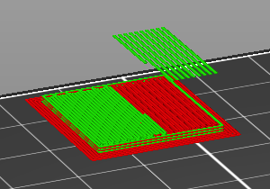
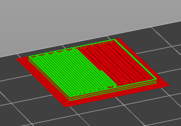

## LastRamRemover

Ever have a print where you are using the single extruder multiple material mode
***BUT*** you are doing the color changes manually? When doing this and using a
wipe tower, at the end of the print PrusaSlicer will have the nozzle go back
over the wipe tower and extrude filament like it does for a normal color change.
But this doesn't make sense because it will do this even when the wipe tower is
not as tall as the current Z height. It also doesn't make sense because this ram
that it is performing isn't necessary because you are doing manual filament
changes.

This post-processing script takes care of that last ram and removes it from the
g-code.

| Before | After |
| ------ | ----- |
|  |  |

This can be run by either directly invoking it with Python, or as a PrusaSlicer
post-processing script.

This tool works well. I've used it for a few prints where I manually changed the
filament. Its pretty easy to verify it worked so definitely be sure to do that
if you use it!
