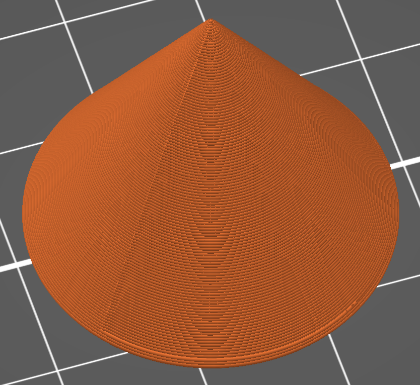
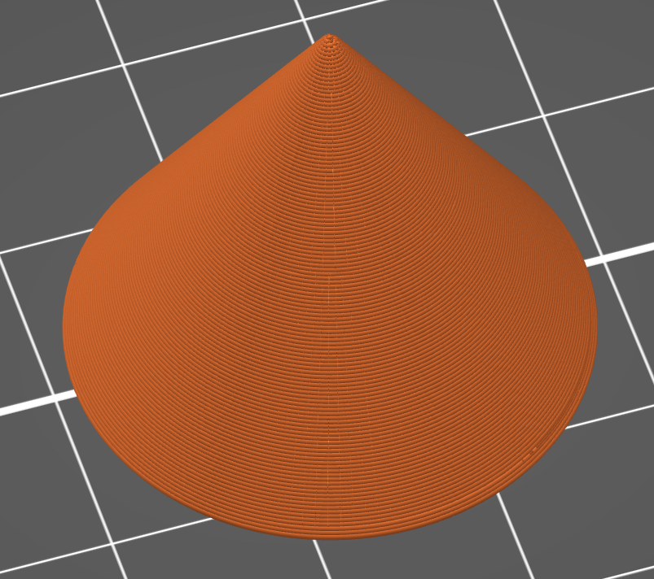

## SlicerVasePlus

SlicerVasePlus aims to remove artifacts from a print that was sliced in vase
mode but has a slope in the Z direction. It does this by gradually interpolating
the x/y position based on the previous layer, initially positioning the layer's
points at a position closer to the previous layer x/y and gradually moving the
points closer to where they were originally meant to be. This approach is used
by Cura and was the inspiration for this tool.

| Before | After |
| ------ | ----- |
|  |  |

This can be run by either directly invoking it with Python, or as a PrusaSlicer
post-processing script. However, it does require some dependencies so those must
be installed prior to use. I've included both a `Pipfile` and a
`requirements.txt` file so either `Pipenv` or `pip` can be easily used.

There are several optional arguments I incorporated into this tool, I think most
of the time running with the defaults is your best bet, but if the output isn't
quite right you can tweak these parameters.

### Optional Arguments
| Argument | Description |
| -------- | ----------- |
| --reversed | Smooth the object from the top down, rather than bottom up.|
| --combined | Smooth the object from both the top down and bottom up and combine the results. |
| --range | Only smooth layers within this range. |
| --interpolate-distance | Interpolate inbetween points on a layer. This value is the desired distance between each interpolated point in mm. |
| --smoothness-ratio | Smooth layer lines over a proportion of their length. If smoothness_ratio is 1, smooth over the entire length, 0.5, half the length, etc... |
| --output-file-path | The path to save the processed output to. If not given, the original file is overwritten. |

This tool seems to work pretty well. When I tested it with a few different
models it produced g-code that looked like what I wanted. I printed a basic cone
with the g-code produced by this tool and it was perfect (the preview above).
I'd still advise using this with caution and would recommend that you always
check the g-code preview before sending it to the printer!
